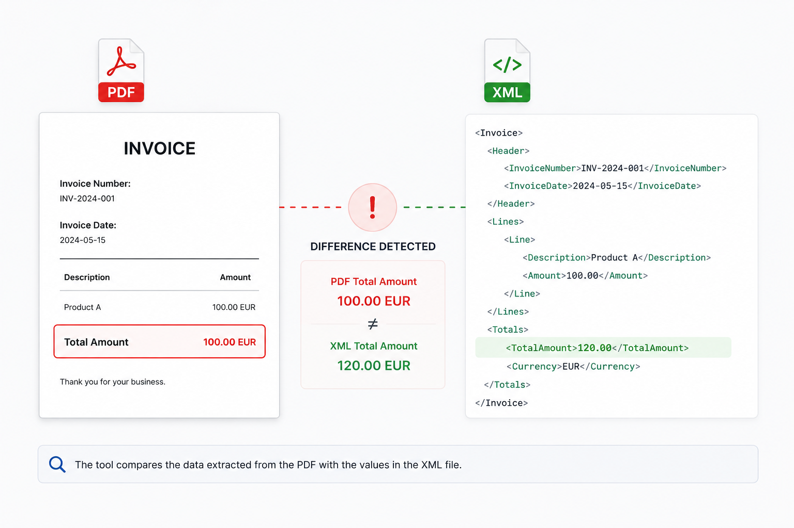

<p align="center">
  
</p>

> 🇫🇷 Français | [🇬🇧 English](./README.md)


[](https://www.youtube.com/@Palks_Studio)
[](https://www.linkedin.com/in/palks-studio/)

<p align="center">
  <a href="https://palks-studio.com">
    
  </a>
</p>


# PDF / XML Comparator, Open Source

Outil local et open source permettant de comparer les données présentes dans un fichier PDF et un fichier XML.

L'objectif est simple : repérer rapidement les valeurs présentes dans une représentation mais qui ne sont pas retrouvées dans l'autre, afin de faciliter une vérification humaine.

Le programme fonctionne entièrement en local, sans API, sans service externe et sans intelligence artificielle.

---

## Structure du projet

```
pdf_xml_comparator/
│
├── main.py                        → Application principale
├── requirements.txt               → Dépendances Python du projet
├── LICENSE.md                     → Licence MIT du projet
│
├── README.md                      → Documentation anglaise
├── README_FR.md                   → Documentation française
│
└── docs/
    ├── images/
    │   ├── Palks_Studio.png       → Logo Palks Studio
    │   └── pdf_xml_comparator.png → Image de présentation du comparateur
    │
    ├── EN/
    │   ├── invoice.pdf            → Exemple de facture en anglais
    │   ├── facturx.xml            → Exemple XML Factur-X en anglais
    │   └── xml_pdf_en.mp4         → Vidéo de démonstration en anglais
    │
    └── FR/
        ├── facture.pdf            → Exemple de facture en français
        ├── facturx.xml            → Exemple XML Factur-X en français
        └── xml_pdf_fr.mp4         → Vidéo de démonstration en français
```

---

## Pourquoi cet outil ?

Un PDF et un XML peuvent représenter le même document tout en contenant des informations différentes.

Une référence peut être différente, un montant peut avoir été modifié, une donnée peut être présente uniquement dans le XML, ou une information visible dans le PDF peut ne pas être retrouvée dans le XML.

Vérifier manuellement les deux fichiers peut rapidement devenir fastidieux.

PDF / XML Comparator automatise une première étape de contrôle en recherchant les différences potentielles entre les deux représentations.

---

## Fonctionnement

Le programme effectue une comparaison dans les deux sens :

### PDF vers XML

Les valeurs détectées dans le PDF sont recherchées dans le XML.

Si une valeur du PDF n'est pas retrouvée dans le XML, elle est signalée pour vérification.

### XML vers PDF

Les valeurs contenues dans le XML sont recherchées dans le texte du PDF.

Si une valeur XML n'est pas retrouvée dans le PDF, elle est également signalée pour vérification.

Cette comparaison bidirectionnelle permet notamment de repérer des situations où une valeur correcte existe quelque part dans les deux fichiers, mais où une autre valeur différente apparaît uniquement dans l'une des représentations.

---

## Normalisation

Certaines différences de présentation sont automatiquement prises en compte afin de limiter les faux écarts.

Par exemple :

- `1000.00` et `1 000,00`  
- `20260724` et `24/07/2026`  
- espaces et espaces insécables  
- certaines représentations numériques équivalentes

La normalisation reste volontairement légère et ne cherche pas à interpréter la signification métier des données.

---

## Rapport

Après comparaison, le programme affiche deux sections :

```text
VALEURS PDF NON RETROUVÉES DANS LE XML
```

et :

```text
VALEURS XML NON RETROUVÉES DANS LE PDF
```

Les valeurs identiques signalées plusieurs fois côté XML sont dédupliquées afin de rendre le rapport plus lisible.

L'interface conserve également une vue du contenu extrait des deux fichiers : le texte détecté dans le PDF, les données extraites du XML, puis le rapport des différences identifiées.

Ces trois zones permettent d'effectuer une première comparaison directement dans l'application, sans avoir à passer constamment d'un fichier à l'autre.

Pour une vérification plus approfondie, les fichiers PDF et XML d'origine restent bien entendu la référence et peuvent être consultés directement.

---

## Important

Une valeur signalée n'est pas nécessairement une erreur.

Le XML peut contenir des codes techniques, des identifiants ou d'autres informations qui n'ont pas vocation à apparaître textuellement dans le PDF.

De la même manière, certaines informations visibles dans le PDF peuvent être présentées différemment dans le XML.

Le programme ne décide donc pas si une différence est correcte ou incorrecte.

Il indique simplement les éléments qui méritent une vérification humaine.

---

## Ce que l'outil ne fait pas

PDF / XML Comparator n'est pas un validateur de conformité.

Il ne vérifie notamment pas :

- la conformité à une norme de facturation  
- un schéma XSD  
- des règles Schematron  
- la conformité PDF/A  
- la validité juridique ou comptable d'un document  
- la cohérence métier d'un champ particulier

Il ne remplace pas un outil de validation spécialisé.

Son rôle est uniquement de faciliter la comparaison des données entre un PDF et un XML.

---

## Approche générique

Le comparateur n'est volontairement pas construit autour d'une liste de champs métier prédéfinis.

Il ne suppose pas qu'une balise particulière représente un montant, un numéro de facture, une quantité ou une autre donnée spécifique.

Cette approche permet de conserver un fonctionnement simple et générique, sans lier le moteur de comparaison à une structure XML particulière.

---

## Utilisation

### Fichiers d'exemple et démonstration

Le dépôt contient deux jeux de fichiers d'exemple permettant de tester directement le comparateur.

Une version française et une version anglaise sont disponibles dans le dossier `docs/`, chacune comprenant un fichier PDF, son fichier XML Factur-X associé ainsi qu'une courte vidéo montrant leur comparaison avec l'outil.

Ces fichiers permettent de découvrir rapidement le fonctionnement du comparateur avant de l'utiliser avec vos propres documents.

### 1. Installer Python

Python 3 est nécessaire pour exécuter le programme.

### 2. Installer la dépendance

```
pip install pypdf
```

### 3. Lancer le programme

```
python main.py
```

### 4. Sélectionner les fichiers

Dans l'interface :

1. sélectionner le fichier PDF  
2. sélectionner le fichier XML  
3. cliquer sur `COMPARE PDF / XML`  
4. examiner les valeurs signalées

Aucune donnée n'est envoyée vers un service externe.

---

## Dépendances

Le projet utilise principalement :

- Python  
- Tkinter  
- pypdf  
- xml.etree.ElementTree  
- re

`Tkinter`, `xml.etree.ElementTree` et `re` font partie de la bibliothèque standard Python.

La seule dépendance Python externe nécessaire au projet est actuellement :

```
pypdf
```

---

## Limites

La comparaison du PDF repose sur le texte pouvant être extrait du document.

Un PDF scanné sous forme d'image, un document dont le texte n'est pas extractible ou certaines structures PDF complexes peuvent donc produire des résultats incomplets.

Le programme effectue une recherche de présence et de représentations équivalentes, mais n'établit pas de correspondance métier entre une zone précise du PDF et une balise XML précise.

Cette limitation est volontaire : l'outil préfère signaler une valeur à vérifier plutôt que déduire une correspondance qui pourrait être incorrecte.

---

## Confidentialité

Le traitement est effectué localement sur la machine de l'utilisateur.

Aucune API externe n'est utilisée et aucun fichier n'est envoyé vers un service tiers.

---

## Licence

Ce projet est distribué sous licence MIT.

© Palks Studio — voir LICENSE.md  
- https://palks-studio.com
